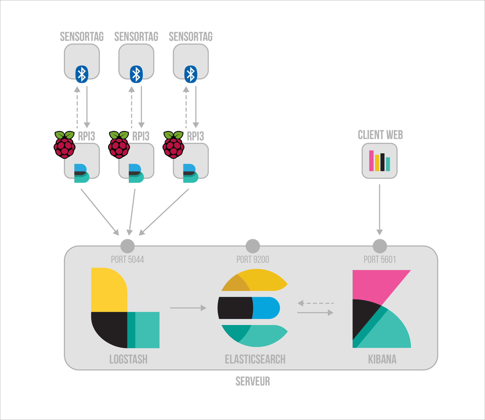

# Récupération, indexation et visualisation de données embarquées

*Pour ce TP, vous travaillerez individuellement. Vous pouvez utiliser votre machine personnelle si vous disposez d'un système d'exploitation Linux ou Mac. Si ce n'est pas le cas, utilisez les machines de la salle D205 car toutes les manipulations ne sont pas réalisables sous Windows.* 

*En fin de journée, vous déposerez sur Moodle un dossier archivé contenant votre répertoire de travail ainsi qu'un compte-rendu répondant aux différentes questions posées dans le sujet.* 

## Introduction

Le but de cette journée de TP et de bâtir une architecture permettant de visualiser des données issues de SensorTags. Ces capteurs émettent en **Bluetooth Low Energy** des informations telles que la température ambiante, la pression atmosphérique ou encore la luminosité.

Pour ce faire, nous utiliserons des **Rasperry Pi 3** pour récupérer ces informations. Grâce à des **scripts Python**, nous contacterons nos capteurs afin d'obtenir les données sous forme de **logs**.
Nous installerons également l'outil **Filebeat** sur nos Raspberry afin d'automatiser l'envoi des logs sur le serveur.  

Ensuite nous mettrons en place un serveur utilisant l'architecture **ELK** (Elasticsearch, Logstash, Kibana). Ce sont 3 outils complémentaires développés par la société Elastic forme un système complet de gestion de logs : 

+ **Elasticsearch** est un puissant moteur d'indexation, de recherche et d'analyse de données
+ **Logstash** collecte et analyse les logs envoyés par Filebeat. Il les parse et les transforme pour ensuite les stocker dans Elasticsearch.
+ **Kibana** offre différents outils de visualisation des données stockées dans Elasticsearch.

Enfin après avoir configuré tous ces outils, nous pourrons indexer nos données et les visualiser en temps réèl.

*Schéma de l'architecture à mettre en place*

## Se connecter sur le réseau local

Votre ordinateur personnel servira de **serveur** pour ce TP. Si vous n'avez pas d'ordinateur, connectez-vous sur les machines de la salle D205 (identifiant : `local192`, mot de passe : `local192`).

Connectez-vous au routeur **Wi-Fi** de la salle. Le nom du routeur est `ORBI46` et la clé pour se connecter au réseau est `deepcheese342`. Si vous utilisez les ordinateurs de l'IUT pensez également à débrancher le câble ethernet.

Pour le TP, vous disposez d'un RPI chacun. Chaque RPI, est numéroté de 09 à 20. Ils sont tous connecté à notre réseau Wi-Fi et disposent d'une IP fixe : `10.0.0.2{N° RPI}`. Par exemple, si j'utilise le RPI n°09 mon adresse sera : `10.0.0.209`. 

Pour travailler sur votre RPI, il faudra vous connecter en **SSH** à ce dernier. Pour cela entrez la commande suivante :
	
	ssh pi@10.0.0.2{N° RPI}

Un mot de passe vous sera ensuite demandé pour vous connecter au RPI. Entrez `raspberry` à la suite de ce message :
	
	pi@10.0.0.2{N° RPI}'s password: 
	
Le protocole SSH permet de prendre le contrôle d'une machine à distance. Vous pourrez donc modifier des fichiers présents sur le RPI depuis votre ordinateur. Attention, vous n'aurez cependant pas d'interface visuelle, tout se passera donc dans votre terminal.

## Récupérer les données sur un Raspberry Pi 3

Une fois connecté sur votre RPI, la première étape est de chercher **l'adresse MAC des capteurs** que nous voulons contacter. 
Pour cela, il faut dans un premier temps allumer les capteurs en appuyant sur le bouton situer sur le côté du capteur. Ensuite depuis le terminal de votre RPI, entrez les commandes suivantes qui permettront de lister les appareils émettant en Bluetooth Low Energie (BLE) :

	sudo hciconfig hci0 up
	sudo hcitool lescan

Vous obtiendrez un résultat qui ressemble à celui-ci :

	B0:B4:48:C8:41:81 CC2650 SensorTag
	
Notez l'adresse correspondant à votre SensorTag.   

Vous avez à votre disposition sur chacun des Raspberry un dossier `/home/pi/SensorTag-Pi3/`. Toujours depuis le terminal, déplacez vous dans ce répertoire. 

	cd /home/pi/SensorTag-Pi3-master/

Contrairement aux iBeacons qui envoient des informations en broadcast, les SensorTags nécessitent un **appairage Bluetooth** pour transmettre l'information. Une **requête** doit être envoyée vers le capteur pour avoir sa **réponse** en retour.

Les fichiers python présents dans ce répertoire permettent justement de contacter les SensorTags et de récupérer leurs données émises par ces derniers. Dans le cadre de ce TP, nous nous consacrerons uniquement au fichier `sensortag-time.py`.

Pour l'exécuter, vous devrez spécifier l'adresse de votre tag. Par exemple :

	python sensortag-time.py B0:B4:48:C8:41:81

> Développez dans ce fichier une fonction permettant de récupérer et d'afficher les données **bruts** (code hexadécimal) envoyées par le capteur à chaque requête.

> Dans ce dossier, créez un répertoire `logs` et à l'intérieur de celui-ci, créez un fichier `sensortag.log`. **Modifiez** ensuite le fichier `sensortag.py` de façon à récupérer des informations sur le SensorTag **toutes les 5 secondes**. À chaque réponse du capteur, **ajouter une ligne** au fichier `sensortag.log` contenant les informations obtenus formatée de la manière suivante :

	27/Feb/2018:13:42:24 +0000 B0:B4:48:BD:F1:80 IRTEMP/18.5 AMBIENTTEMP/23.3125 LUMINANCE/107.4 HUMIDITY/0.0 PRESSURE/1018.7

	
### Configuration de filebeat

> En vous aidant de [sa présentation](https://www.elastic.co/fr/products/beats/filebeat), expliquez le **principe** de fonctionnement de Filebeat. Pourquoi nous l'utilisons dans notre cas d'application ?
> Par quoi pourrait-on le remplacer ? 
> Quels sont ces avantages ?

Dans le dossier `/home/pi/workdir`, éditez le fichier de configuration `filebeat.yml` : 

	cd /home/pi/workdir
	sudo nano filebeat.yml

Le paramètre `paths` nous permet de spécifier dans quel(s) répertoire(s) Filebeat doit récupérer les logs. Modifiez cette ligne en précisant le répertoire où nos logs sont stockés :
	
	paths:
	- /home/pi/SensorTag-Pi3-master/logs/*.log

Plus loin dans le fichier, décommentez la ligne `output.logstash`. Décommentez également la ligne `hosts` dans laquelle vous préciserez l'adresse et le port sur lesquels le service Logstash écoutera les données envoyées par Filebeat (à savoir l'adresse IP de votre serveur et le port par défaut `5044`). Par exemple :
	
	#----------------------------- Logstash output --------------------------------
	output.logstash:
	# The Logstash hosts
	hosts: ["10.0.0.11:5044"]
	
Nous en avons fini avec la configuration de Filebeat.
Pour quitter le fichier, faites `CTRL` + `X` puis appuyer sur `Y` (ou sur `O` selon vos paramètres systèmes) pour enregistrer les changements.

## Mettre en place un serveur avec l'architecture ELK

Retournez à présent sur votre serveur. Nous allons configurer les différents outils nécessaires à la réalisation du TP.

Dans le dossier utilisateur de votre serveur, créer votre **répertoire de travail** `tp-IoT` et déplacer vous dans le dossier depuis votre terminal.

	cd ~/tp-IoT
	

### Configuration de Elasticsearch

Rendez-vous sur [la page web d'Elasticsearch](https://www.elastic.co/fr/products/elasticsearch) et téléchargez le en ZIP. Déplacez ensuite l'archive téléchargée dans votre répertoire de travail et dézippez la. Renommez le dossier `elasticsearch`.

Déplacez vous maintenant de ce dossier et éditez le fichier de configuration `elasticsearch.yml` :

	cd elasticsearch
	nano config/elasticsearch.yml
	
Dans la rubrique `Network`, décommentez et modifiez la ligne `network.host` en indiquant l'adresse IP de votre serveur. Par exemple :

	network.host: 10.0.0.11
	
C'est la seule modification que nous effectuerons dans ce fichier, nous laisserons les autres paramètres avec leur valeur par défaut. Enregistrez et quittez le fichier.

Lancez à présent le service Elasticsearch :

	./bin/elasticsearch
	
> Avant de passer à la configuration de Kibana, présentez Elasticsearch. A quoi sert-il ? Donnez différents exemples d'applications où l'utilisation d'Elasticsearch pourrait être appropriée.

### Configuration de Kibana

Ensuite, [téléchargez Kibana](https://www.elastic.co/fr/products/kibana). Dézipper l'archive dans votre répertoire de travail et renommez le dossier `kibana`.

Comme pour Elasticsearch, éditez le fichier de configuration :

	cd ../kibana
	nano config/kibana.yml
	
Dans ce fichier, nous allons modifier la ligne `server.host` qui précise où doit s'exécuter Kibana et la ligne `elastic.url` qui déclare l'adresse de l'instance Elasticsearch à contacter pour effectuer les requêtes.
Si mon adresse IP est 192.168.0.15 les modifications doivent ressembler à ça :

	server.host: "10.0.0.11"
	elasticsearch.url: "http://192.168.0.15:9200" 
	
Pour finir, lancez Kibana en executant la commande suivante : 

	./bin/kibana

### Configuration de Logstash

Comme pour les outils précédents, [téléchargez Logstash](https://www.elastic.co/fr/products/logstash) et dézipper l'archive avant de la renommer `logstash` dans votre dossier de travail. 

Pour Logstash, pas besoin de modifier le fichier `logstash.yml`. 
Cependant, il faut créer un fichier de configuration permettant de dire à Logstash où il doit aller chercher les données, comment il doit les filtrer et où il doit les envoyer. Pour cela créez un fichier `logstash.conf` et editez le. 

	cd ../logstash
	touch logstash.conf
	nano logstash.conf
	
Copiez-collez le contenu ci-dessous dans le fichier : 

	input {
	}
	# filter {
	#
	# }
	output {
	}

Les fichiers de configuration Logstash se décompose en 3 partie. Un partie `input` permettant de préciser d'où viennent les données entrantes. Un partie `filter` qui permet de parser les données selon le modèle spécifié, et enfin, une partie `output` pour dire où doivent aller les données en sortie.  

Nous allons premièrement préciser la provenance des données.
Dans notre cas elles seront envoyés par Filebeat. Il existe un pugin permettant à Logstash d'écouter les informations envoyées par Filebeat : 

	input {
	  beats {
	  	host => 10.0.0.11
	  	port => 5044
	  }
	}
	
Pour tester la bonne réception des données, nous allons dans un premier temps afficher les données en sortie dans la console sans les filtrer:

	output {
		stdout { codec => rubydebug }
	}

Enregistrez et quittez le fichier puis lancez Logstash :

	./bin/logstash -f "logstash.conf" 
	
Si Filebeat est lancé sur le RPI, et que tous les fichiers sont bien configurés, votre terminal doit renvoyer ce type d'informations à chaque fois qu'il reçoit un nouveau log :
  
	{
		"@timestamp" => 2018-02-23T21:03:02.344Z,
		"host" => "MBP-de-Tim",
		"message" => "27/Feb/2018:13:42:24 +0000 B0:B4:48:BD:F1:80 IRTEMP/18.5 AMBIENTTEMP/23.3125 LUMINANCE/107.4 HUMIDITY/0.0 PRESSURE/1018.7",
		"@version" => "1"
	}

Arrêtez le service Logstash (`CTRL` + `C`).

Nous souhaitons à présent filtrer les données afin d'obtenir ceci en sortie : 
 	
	{
		"@version" => "1",
		"pressure" => 1018.7,
		"humidity" => 0.0,
		"sensor" => "B0:B4:48:BD:F1:80",
		"host" => "MBP-de-Tim",
		"luminance" => 107.4,
		"ambianttemp" => 23.3125,
		"@timestamp" => 2018-02-23T17:29:32.000Z,
		"irtemp" => 18.5
	}

	
> En suivant la documentation de Logstash, **modifiez** le contenu de la balise `filter` du fichier `logstash.conf` pour filtrer les données comme ci-dessus (utilisez le plugin `grok`). 
Effectuez des tests en relançant le service Logstash.
Détaillez le contenu de votre balise `filter`dans votre compte-rendu. 
 

Si tout se passe bien, nous pouvons à présent utiliser le plugin `elasticsearch`en sortie de Logstash pour indexer nos données parser à Elasticsearch. Editez de nouveau le fichier `logstash.conf` et remplacer le contenu de la balise `output` par le bloc suivant : 

    elasticsearch {
        hosts => ["10.0.0.11:9200"]
        index => "logstash-sensortag"
    }
    
> Décrivez les lignes de ce bloc `elasticsearch`.

## Visualiser les données avec Kibana

Une fois l'indexation des données commencée, rendez-vous sur l'application Kibana : `http://10.0.0.11:5601`.

Avant de faire quoi que se soit vous devrez créer un index qui correspond à celui des données envoyées dans Elasticsearch depuis Logstash : `logstash-sensortag*`. Regardez [la documentation de Kibana](https://www.elastic.co/guide/en/kibana/5.5/index.html) pour plus de précision. 

> Créez un tableau de bord avec différentes dataviz de votre choix. Votre imagination est la seule limite... 
Faites apparaître vos visualisations dans votre compte-rendu en prenant des captures d'écran et décrivez les. 
>Vous pouvez également ajouter des données GPS fictives à vos logs. Avec Kibana, il est possible de faire des visualisations géographiques permettant donc de situer tous vos capteurs.
Amusez-vous bien ! :)
